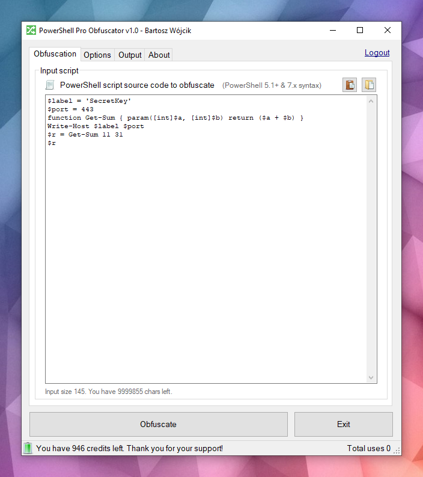
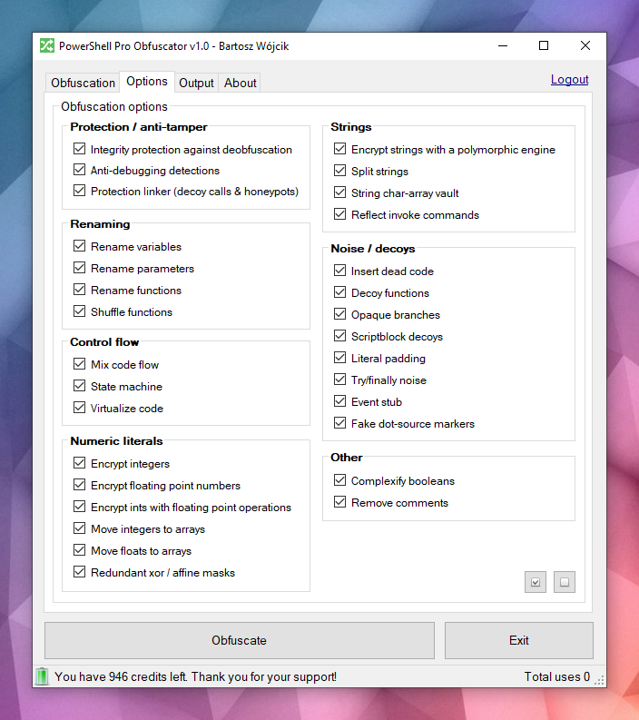
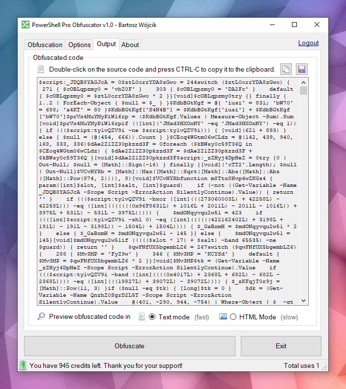
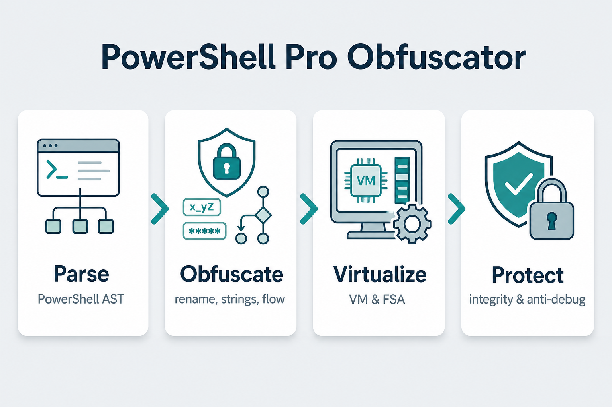
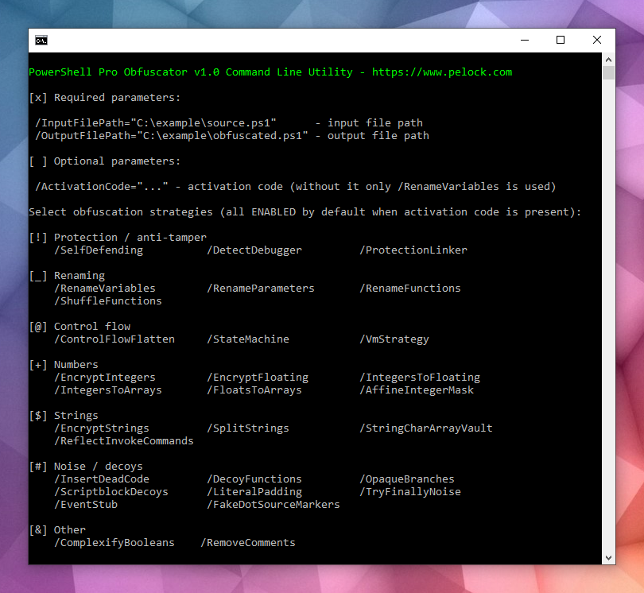

# PowerShell Pro Obfuscator — Obfuscate & Virtualize PowerShell Code

**PowerShell Pro Obfuscator** protects proprietary `.ps1` scripts with renaming, polymorphic string and integer encryption, control-flow flattening, finite-state automata (FSA), a VM engine, self-defending integrity checks, a protection linker, and anti-debugging probes.

Obfuscate, virtualize & protect PowerShell `.ps1` scripts with polymorphic string encryption, VM engine, finite-state automata transforms, self-integrity & anti-debugging checks — via GUI, CLI, online tool, or API.

More technical details, downloads, documentation available at:

https://www.pelock.com/products/powershell-pro-obfuscator



It's available for Windows & Linux:

* https://www.pelock.com/products/powershell-pro-obfuscator/download

Multiple programming APIs available:

* https://www.pelock.com/products/powershell-pro-obfuscator/api

An online obfuscator interface:

* https://www.pelock.com/powershell-pro-obfuscator/

## Why PowerShell scripts need obfuscation?

Scripts are typically distributed as plain `.ps1` files or embedded in modules. That convenience means anyone with file access can read the full logic, hunt for credentials or API keys in strings, and steal your algorithms unless you take extra steps to hide intent.

[PowerShell](https://learn.microsoft.com/powershell/) is a cross-platform shell and scripting language built on .NET. It is widely used for automation, configuration, DevOps pipelines, and endpoint management on Windows and Linux.

## Obfuscation strategies

PowerShell Pro Obfuscator comes with many advanced obfuscation, virtualization & protection strategies. You can easily tune protection versus size and performance.



###  Powerful obfuscation

PowerShell Pro Obfuscator uses state-of-the-art obfuscation strategies such as polymorphic string encryption, integers & floats encryption, and decoy noise. The result conceals literals and structure while preserving tested runtime behaviour.

###  Code virtualization

Selected statements are lifted into a random generated VM engine opcodes with shuffled switch cases, decoy opcodes, and an obfuscated dispatcher loop. Analysts must interpret the virtual machine instead of reading plain PowerShell.

###  Finite-state automata (FSA)

Finite-state automata (FSA) obfuscation rewrites linear PowerShell statement blocks into dual-state automata with opaque schedulers and shuffled dispatch handlers. Instead of reading code top to bottom, analysts must follow numeric states, transition tables, and decoy paths to reconstruct the original order.

###  Anti-debugging

Anti-debugging protection inserts polymorphic probes that detect attached debuggers, PowerShell breakpoints, debug preference and tracing modes, and related host signals. When a check fires, the obfuscated script exits silently instead of revealing protected logic under interactive analysis.

###  Self-integrity checks

A bootstrap probe verifies on-disk script shape (function counts and integrity tokens) and sets a tamper key when the file no longer matches the obfuscated build. String decryptors consume that key, so patched scripts return garbage instead of plaintext. This self-defending layer raises the cost of casual deobfuscation and file edits.

###  Protection linker

A late pass wires honeypot resolvers, bogus helper calls with random arguments, and shallow-stack tripwires that stay active only before bootstrap completes. Extracted snippets keep noisy call surfaces that look real under static review. Normal execution after a successful integrity check remains unchanged.

## Before and after obfuscation

Look at this example — the same script becomes harder to read at a glance after obfuscation.

### Sample PowerShell script before obfuscation

```powershell
function Get-Greeting {
    param([string]$Name)
    Write-Host "Hello World from $Name!"
}
Get-Greeting "PowerShell Pro Obfuscator"
```

### After obfuscation

```powershell
$script:_HnJTskg = 0
$jwNTQ = 297 * 400 + 36
$x4e8bfda = [Math]::Abs($jwNTQ - 8074)
$_EvKocNn = [Math]::Max($jwNTQ, $x4e8bfda) - [Math]::Min($jwNTQ, $x4e8bfda)
[void]$_EvKocNn
$script:_jUoXkBYh = 0
function gnJjzMCN3V8P {
    param([int]$slot, [int]$salt, [int]$guard)
    if (-not ((Get-Variable -Name _HnJTskg -Scope Script -ErrorAction SilentlyContinue).Value)) { return '' }
    @('JFE', 'm0ao', 'R8Ysw') | ForEach-Object { $_.ToUpper() } | Out-Null
if ((((($slot * 31) + $salt) -band 65535) -ne $guard)) { return '' }
    $tk = (Get-Variable -Name _jUoXkBYh -Scope Script -ErrorAction SilentlyContinue).Value
    $IEm39CSpDOEFp = @{ 'Ouj1' = 455; 'vjzO' = 170; 'IQNV' = 291 }
$IEm39CSpDOEFp['R5LrM'] = $IEm39CSpDOEFp['Ouj1'] + $IEm39CSpDOEFp['vjzO']
$YWxSO = ($IEm39CSpDOEFp.Values | Measure-Object -Sum).Sum
[void]$YWxSO
if ($null -eq $tk) { [long]$tk = 0 }
    $v93a130f2e4 = 508
switch ($v93a130f2e4) {
    524 { $_GYF7IA14Go = 'H1Vph' }
    561 { $_GYF7IA14Go = 'HAWoB' }
    default { $_GYF7IA14Go = $v93a130f2e4 * 2 }
}
[void]$_GYF7IA14Go
$dk = (Get-Variable -Name vb6a18ffee4 -Scope Script -ErrorAction SilentlyContinue).Value
    try { $xgLN5KZyEusFo7 = [Math]::Sqrt(850) } finally { [void]$xgLN5KZyEusFo7 }
if ($null -eq $dk) { [long]$dk = 0 }
    $d = @(46866, 46865)
    if ((((-not 113))-and(([int](272 -ne 272) -eq 21)))-and(([Math]::Sign(-12) -eq 4))) { $w4iTzi2hooy1GW = @(711, 562, 665); $w4iTzi2hooy1GW = ($w4iTzi2hooy1GW | Measure-Object -Sum).Sum }
$r = ''
    for ($s9qOSpiZzufQlVyV = 0; $s9qOSpiZzufQlVyV -lt $d.Length; $s9qOSpiZzufQlVyV++) {
        [long]$v = [long]$d[$s9qOSpiZzufQlVyV]
        for ($jL9gL7PEtQeIS = 2; $jL9gL7PEtQeIS -ge 0; $jL9gL7PEtQeIS--) {
            for ($PsbomDHxAy = 2; $PsbomDHxAy -ge 0; $PsbomDHxAy--) {
                    [long]$v = [long]$v + ([long](230))
            }
        }
        for ($zhH33vzxjIzegl9 = 0; $zhH33vzxjIzegl9 -ge 0; $zhH33vzxjIzegl9--) {
                [long]$v = [long]$v + ([long]([int]((((((236 + (-3 * $s9qOSpiZzufQlVyV) + (3 * $zhH33vzxjIzegl9))) % 256) + 256) % 256))))
                [long]$v = [long]$v -bxor ([long](53766))
        }
        [long]$v = [long]$v - ([long]($salt + $slot + $tk + $dk + 0))
        if ([long]$v -ge 0 -and [long]$v -le 0xFFFF) { $r += [char][int][long]$v }
        elseif ([long]$v -ge 0x10000 -and [long]$v -le 0x10FFFF) { $r += [System.Char]::ConvertFromUtf32([int][long]$v) }
    }
    return $r
}
and more...
```

Would you still recognise the original intent if you only had the obfuscated text and no prior copy of the script?



### How does PowerShell Pro Obfuscator work?

The engine parses PowerShell source into an AST tree, then applies selectable transforms: identifier renaming, control-flow flattening, finite-state automata (FSA), VM virtualization, polymorphic string and integer encryption, noise and decoy insertion, self-defending integrity probes, the protection linker, and anti-debugging checks. Many techniques are specific to this product; some ideas are shared with our other protection tools.



When all passes finish, the engine emits a new `.ps1`. Edge cases in the PowerShell grammar and hosting environments mean you should always test the output in your target runtime.

## Protect your PowerShell scripts & algorithms

Take no chances, use **PowerShell Pro Obfuscator** to obfuscate, virtualize and protect your PowerShell scripts and algorithms.

Our company has a long history in obfuscation technologies and code obfuscators (see our [x86 Assembly](https://www.pelock.com/products/obfuscator), [AutoIt](https://www.pelock.com/products/autoit-obfuscator) & [Java](https://www.pelock.com/products/jobfuscator) obfuscators).

We actively bugfix, research and develop new obfuscation strategies for our tools.

You can count on our expertise and support in this field.

### Installation

The preferred way to install the Web API SDK is via RubyGems.

```bash
gem install powershell-pro-obfuscator
```

```ruby
require "powershell-pro-obfuscator"
```

The gem is published at https://rubygems.org/gems/powershell-pro-obfuscator

## Usage examples

### Example — `login.rb`

```ruby
# frozen_string_literal: true

###############################################################################
#
# PowerShell Pro Obfuscator WebApi interface usage example.
#
# In this example we will verify our activation key status.
#
# Version        : v1.0.0
# Language       : Ruby
# Author         : Bartosz Wójcik
# Web page       : https://www.pelock.com
#
###############################################################################

$LOAD_PATH.unshift(File.expand_path("../lib", __dir__))
require "powershell-pro-obfuscator"

result = PowerShellProObfuscator.new("ABCD-ABCD-ABCD-ABCD").login
if result
  puts "Demo version status - #{result['demo']}"
  puts "Usage credits left - #{result['credits_left']}"
  puts "Total usage credits - #{result['credits_total']}"
  puts "Max. source code size - #{result['string_limit']}"
else
  warn "Something unexpected happen while trying to login to the service."
end
```

### Example — `options.rb`

```ruby
# frozen_string_literal: true

###############################################################################
#
# PowerShell Pro Obfuscator WebApi interface usage example.
#
# In this example we will obfuscate sample source with custom options.
#
# Version        : v1.0.0
# Language       : Ruby
# Author         : Bartosz Wójcik
# Web page       : https://www.pelock.com
#
###############################################################################

$LOAD_PATH.unshift(File.expand_path("../lib", __dir__))
require "powershell-pro-obfuscator"

client = PowerShellProObfuscator.new("ABCD-ABCD-ABCD-ABCD")

# should the source code be compressed (both input & compressed)
client.enable_compression = false

#
# global obfuscation options
#
# you can disable a particular obfuscation strategy globally if it
# fails or you don't want to use it without modifying the source codes
#
# by default all obfuscation strategies are enabled
#

# protection against tampering with protected code (integrity verification)
client.self_defending = true

# protection linker (decoy call graph)
client.protection_linker = true

# rename variable names to random string values
client.rename_variables = true

# rename parameter names to random string values
client.rename_parameters = true

# rename function names to random string values
client.rename_functions = true

# shuffle function order in the output source
client.shuffle_functions = true

# change linear code execution flow via control-flow flattening
client.control_flow_flatten = true

# rewrite statement blocks into finite-state automata (state-machine obfuscation)
client.state_machine = true

# lift selected statements into a VM engine (virtualized statements)
client.vm_strategy = true

# encrypt integers
client.encrypt_integers = true

# split strings into concatenated chunks
client.split_strings = true

# encrypt strings using randomly generated polymorphic encryption algorithms
client.encrypt_strings = true

# move integers to arrays
client.integers_to_arrays = true

# move floats to arrays
client.floats_to_arrays = true

# insert dead code
client.insert_dead_code = true

# replace boolean conditions with equivalent complex expressions
client.complexify_booleans = true

# represent integers via floating-point math
client.integers_to_floating = true

# encrypt floating point numbers
client.encrypt_floating = true

# insert decoy functions
client.decoy_functions = true

# insert anti-debugging detections
client.detect_debugger = true

# insert fake dot-source comment markers
client.fake_dot_source_markers = true

# insert opaque predicate branches
client.opaque_branches = true

# insert scriptblock decoys
client.scriptblock_decoys = true

# insert here-string padding
client.literal_padding = true

# use indirect command invocation
client.reflect_invoke_commands = true

# store string fragments in char-code array vaults
client.string_char_array_vault = true

# wrap code in try/finally blocks with dead noise
client.try_finally_noise = true

# apply redundant xor / affine integer masks
client.affine_integer_mask = true

# insert dead event/timer stubs
client.event_stub = true

# strip comments from the output source
client.remove_comments = true

source = <<~PS
  function Get-Greeting {
      param([string]$Name)
      Write-Host "Hello World from $Name!"
  }
  Get-Greeting "PowerShell Pro Obfuscator"
PS

result = client.obfuscate_script_source(source)
if result && result["error"] == PowerShellProObfuscator::ERROR_SUCCESS
  puts result["output"]
else
  warn "An error occurred, error code: #{result && result['error']}"
end
```

### Example — `simple.rb`

```ruby
# frozen_string_literal: true

###############################################################################
#
# PowerShell Pro Obfuscator WebApi interface usage example.
#
# In this example we will obfuscate sample source with default options.
#
# Version        : v1.0.0
# Language       : Ruby
# Author         : Bartosz Wójcik
# Web page       : https://www.pelock.com
#
###############################################################################

$LOAD_PATH.unshift(File.expand_path("../lib", __dir__))
require "powershell-pro-obfuscator"

client = PowerShellProObfuscator.new("ABCD-ABCD-ABCD-ABCD")

source = <<~PS
  function Get-Greeting {
      param([string]$Name)
      Write-Host "Hello World from $Name!"
  }
  Get-Greeting "PowerShell Pro Obfuscator"
PS

result = client.obfuscate_script_source(source)
if result && result["error"] == PowerShellProObfuscator::ERROR_SUCCESS
  puts result["output"]
else
  warn "An error occurred, error code: #{result && result['error']}"
end
```

See the `examples/` directory in this repository for complete samples.

## Use PowerShell Pro Obfuscator Online

Online interface for PowerShell Pro Obfuscator is available at:

https://www.pelock.com/powershell-pro-obfuscator/

## Windows GUI client and command line version

#### PowerShell Pro Obfuscator comes also with full GUI version for Windows:


#### Obfuscation options:


#### Obfuscated PowerShell script:


## Download

You can download it at:

https://www.pelock.com/products/powershell-pro-obfuscator/download

Installation package contains an additional command line interface:



PowerShell Pro Obfuscator ships with a command-line interface for Windows and Linux automation.

Use it to integrate obfuscation into build servers, CI jobs, or batch packaging.

Bartosz Wójcik

* Visit my site at — https://www.pelock.com
* X — https://x.com/PELock
* GitHub — https://github.com/PELock
